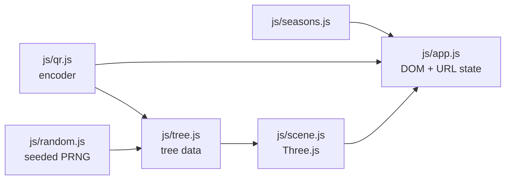

# QR Tree

A link becomes a small landscape. The terrain *is* the QR code — every dark
module is a raised block, every light module stays low — and a tree grows out
of it, seeded from the code's own bit pattern. Tap the scene and it flattens
into an ordinary scannable code.

Inspired by [tree.icqr.com](https://tree.icqr.com/). This is an independent
implementation, not a copy of that code: different renderer, different tree
algorithm, own QR encoder.

## What's actually going on

**The code is the ground.** A QR matrix is a grid of booleans, which is
already a heightmap. Dark modules extrude to height 1, light modules sit at
0.16. From a three-quarter angle that reads as terrain. From directly above,
with the blocks flattened, it is a QR code with ordinary black-on-white
contrast.

**One number drives the transition.** `progress` runs 0 to 1 and everything
follows it — the camera swings from three-quarter view to straight down, the
blocks flatten, the tree shrinks into its own base, grass and petals fade, and
the colours harden towards print contrast. There is no separate "flat mode";
there is one continuous animation controlled by a single float.

**Flattening is one property, not 1600 matrix writes.** Every raised block is
the same height, so the height lives in `InstancedMesh.scale.y` rather than in
the per-instance matrices. Collapsing the terrain is a single assignment per
frame.

**The tree is a function of the link.** The seed is an FNV-1a hash of the
module matrix, fed into a mulberry32 generator. The same URL grows the same
tree on any machine, forever. Branches come from a recursive branching
grammar; blossoms cluster at the tips; grass only sprouts where a dark module
borders a light one, so the planting traces the outline of the code.

## The QR encoder is hand-written, and tested

`js/qr.js` implements byte-mode QR encoding from scratch — Galois field
arithmetic, Reed–Solomon error correction, block interleaving, all eight mask
patterns with penalty scoring, format and version information. Versions 1–10,
all four error correction levels.

A QR generator that looks plausible but doesn't scan is worse than none, so
it's checked two independent ways:

1. **Against a reference.** Matrices are compared bit-for-bit with the
   `qrcode` package.
2. **Through a real decoder.** Each matrix is rasterised to pixels and read
   back with `jsqr`, proving it actually scans.

```bash
npm install
npm test
```

## Running it

```bash
python3 -m http.server 8000
# http://localhost:8000
```

No build step. Three.js comes from a CDN via the import map in `index.html`;
the page needs to be served over HTTP because import maps don't work from
`file://`. To publish, enable GitHub Pages on the default branch root —
`.nojekyll` is there so Pages serves the directories as-is.

## Files

Dependencies point one way — nothing below knows about anything above it:



| File | Job |
| --- | --- |
| `js/qr.js` | QR encoding. No dependencies. |
| `js/random.js` | Seeded hash and PRNG, so trees are reproducible. |
| `js/tree.js` | Grows branch/blossom/grass data from the matrix. Pure data, no Three.js — which is why it's testable in Node. |
| `js/seasons.js` | Season and palette definitions. |
| `js/scene.js` | Three.js scene, instanced terrain, and the progress-driven transition. |
| `js/app.js` | Form handling, URL state, PNG export. |

## Honest limits

**Your phone is not scanning a tree.** It scans the flattened view. The 3D
scene is the thing that makes someone stop and look; the actual scan target is
a normal QR code. Any claim to the contrary — here or elsewhere — is marketing.

**Don't use this for anything load-bearing.** Print, payments, or a link you
can't fix later deserve a plain QR code that you have tested on real devices.
This is for social posts, invitations and demos.

**Versions 1–10 only**, which caps content at roughly 270 bytes at level L and
less at higher levels. Longer input throws rather than silently truncating.
Extending it means adding rows to `ECC_BLOCKS` and `ALIGNMENT`.

**Segmentation is byte-mode only.** Real encoders split input into numeric and
alphanumeric runs to save space, so for text with long digit runs this
sometimes picks a version larger than it strictly needs. Correct, just not
maximally compact.

## State in the URL

Season, palette, error correction level and the link itself live in the query
string, so a shared link reproduces the exact scene. Everything runs in the
page — the link is never sent anywhere.

## Licence

MIT. See `LICENSE`.
